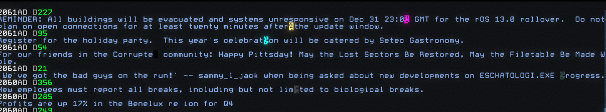
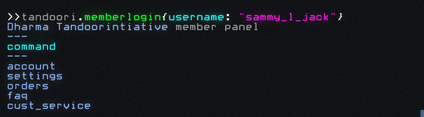
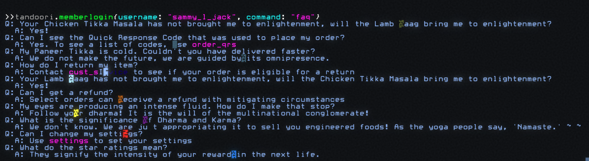
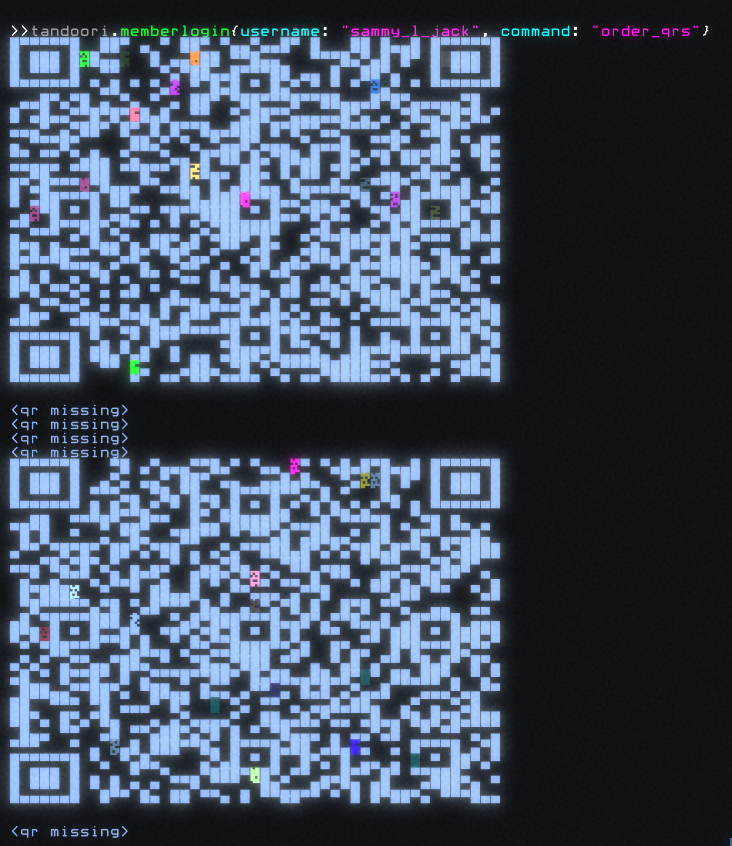
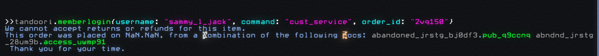

# Tier 2

Tier 2 content is `HIGHSEC` or `MIDSEC` and can steal your GC.

## How to Find Tier 2 Corporations

You can find Tier 2 corporations by searching through `HIGHSEC` and `MIDSEC`
[sectors](/gameplay/sectors).

Tier 2 corporation scripts have the following extensions:
  - `.members`
  - `.memberlogin`
  - `.member_access`
  - `.members_only`

When these scripts [shift](/gameplay/sectors#shift-operations), the extensions
rotate: a script that ended with `.members_only` today may end in `memberlogin`
tomorrow.

## How to Hack Tier 2 Corporations

When you run a Tier 2 corporation's `member` script, you'll see something like
this:


Every `member` corporations script has the same basic format:

```
<corporation slogan>

enter your username to continue.
```

Username is in blue so we know it's a key we need to pass into the script. To
find possible usernames, search the corporation's news feed:

```javascript
tandoori.public{cmd: "news"}
```



Look for anything that could be a username. Here we see:

```
2061AD D21
'We've got them on the run!' -- sammy_l_jack when being asked about...
```

Enter that username into the tier 2 script:

```javascript
tandoori.memberlogin{username: "sammy_l_jack"}
```

If it's a valid username, you'll see something like this:



Run the `faq` command:

```javascript
tandoori.memberlogin{username: "sammy_l_jack", command: "faq"}
```



You'll should see some cyan colored text that mentions `qrs`. Run that command:

```javascript
tandoori.memberlogin{username: "sammy_l_jack", command: "order_qrs"}
```



Scan those QR codes with your phone and you'll be given a JSON object:

```json
{"id":"2vq150","user":"1138","packing_notes":"expired","jts":"dz6oede"}
```

Take that order ID and run the `cust_service` command with it:

```javascript
tandoori.memberlogin{username: "sammy_l_jack", command: "cust_service", order_id: "2vq150"}
```

You'll see a list of locs you can attempt to crack:



## Tier 2 Corporations List

See [_References: Corporations_](/references/corporations) for a complete list
of corporations.